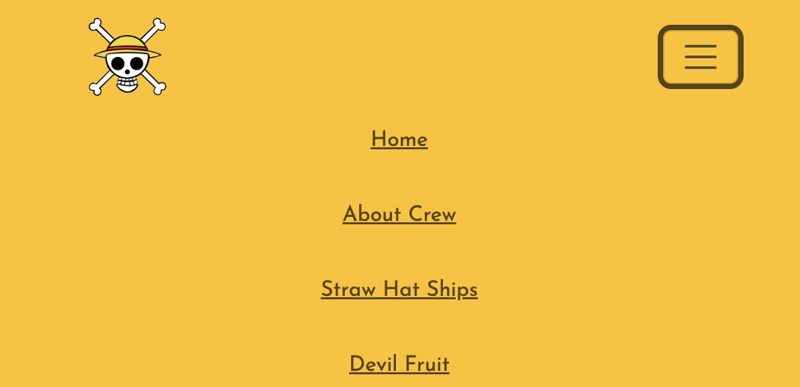
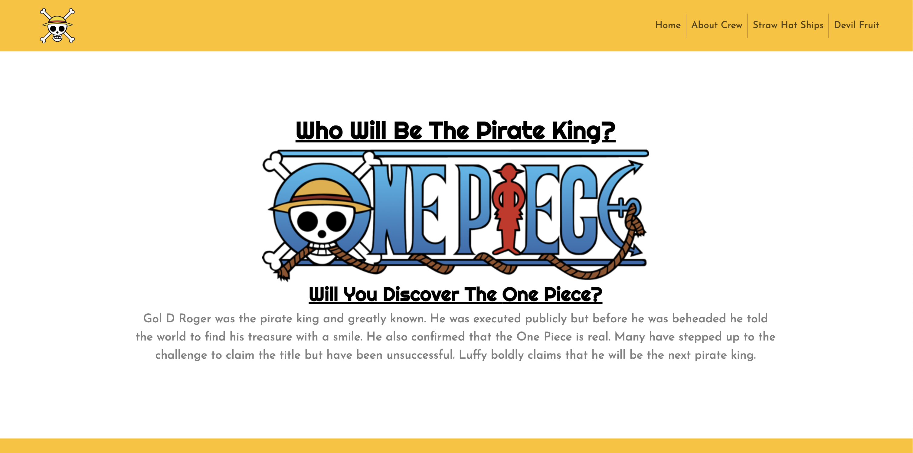
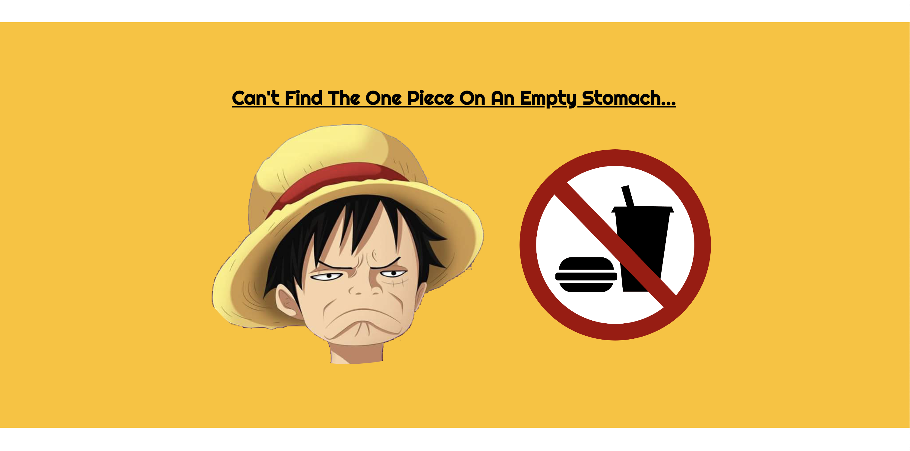
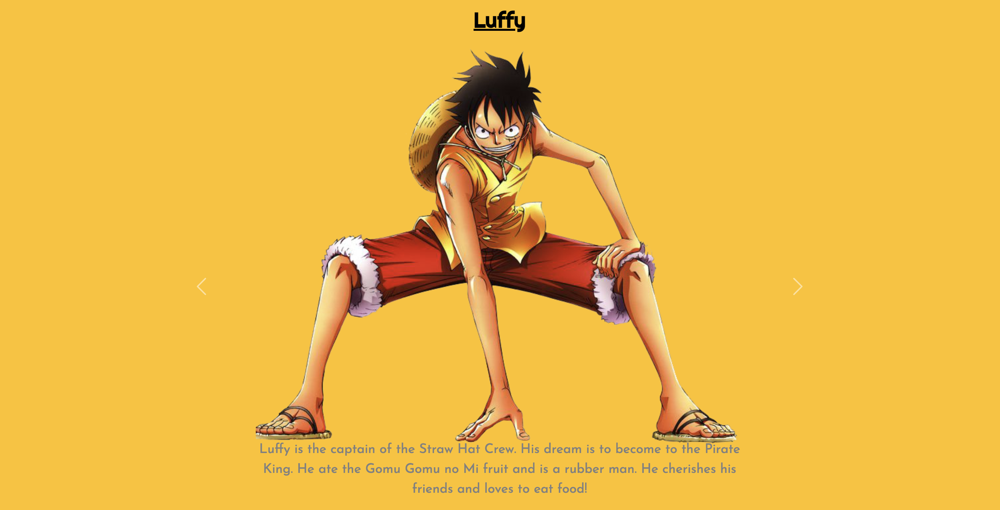
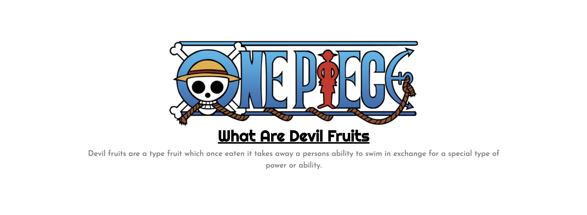
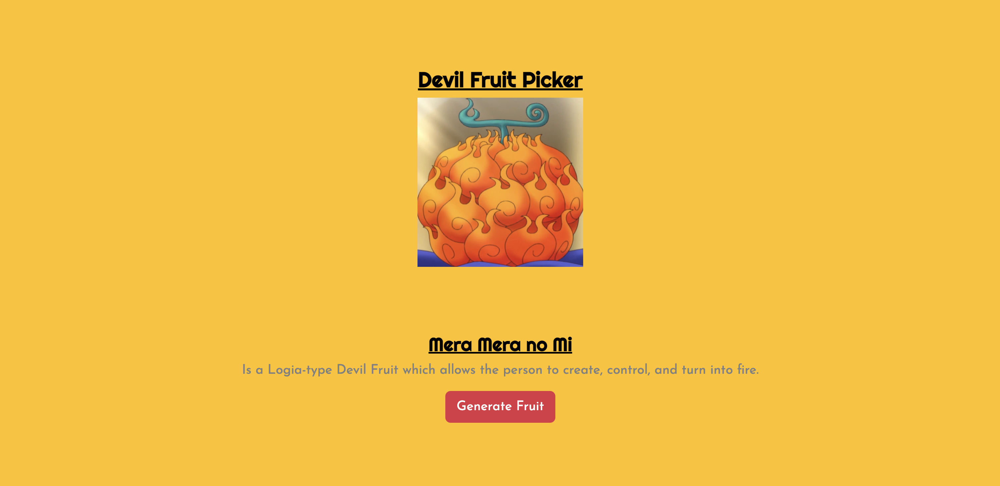

<h1>One Piece Fan Page</h1>

This One Piece fan page was done for CS50 course. I decided to create this based off the One Piece anime because it's a good show and you should watch it.

This uses HTML, CSS, JS, and Bootstrap 5.

<h2>Navigation Bar</h2>

When collapsed there is a button which expands to show additional pages. The navigation links go to each corresponding page. When hovering over the links the color changes to light blue. The logo link points back to the homepage.

<h2>Home Page</h2>

The hompage has three sections. The top gives a breif desciption. The middle is for fun with Luffy. The bottom has a button to direct user to the about crew page.

<h3>About Crew</h3>

The about crew page goes over the crew members of the Straw Hat's with a quick description and picture. This uses the Boostrap 5 carousel feature. You can navigate with the carousel buttons or use one of the crew member external buttons to navigate as well. The bottom of the page has a button to direct the user to the next page about the crew's ships.

<h2>Devil Fruit</h2>

This page goes over a quick description of "Devil Fruits". This also inludes some custom JavaScript code. JavaScript uses a random number generater between 1-41. This will then select the corresponding devil fruit image along with a brief discription. You can generate another random devil fruit by simply clicking the "Generate Fruit" button. The bottom of the page then has a button which encourages and directs the user to Crunchyroll to start watching the "One Piece Anime"

